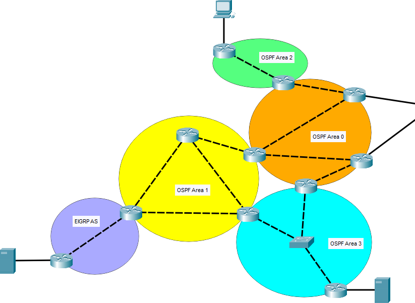
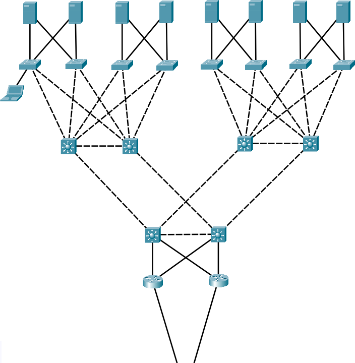

# CCNA Comprehensive Practice Project in Packet Tracer

<div id="intro"/>

## Introduction

This project is one that I used for myself to practice getting ready taking the exam for the CCNA (Cisco Certified Network Associate) 200-301 certification. It is a relatively large network (as in for one Packet Tracer simulation) meant to resemble a WAN containing 4 (5?) diverse types of networks that each implement different functionalities. Unfortunately, I've hit the wall pretty often when it came to implementing a great deal of what I wanted to inside of Packet Tracer, which means this project is retired or set to retire in favor of partially starting over in a network emulator such a GNS3.

Nevertheless, I am making this public for anyone to view if they so please.

<br>

## Table of Contents

1. [Introduction](#intro)
2. [Configuration Management](#scripts)
    1. [WIP](#scripts-wip)
3. [Passwords](#passwords)
4. [Sub-Network: ISP](#ispnet)
    1. [Layer 2](#ispnet-l2)
    2. [Wireless](#ispnet-wifi)
    3. [Layer 3](#ispnet-l3)
    4. [Services](#ispnet-apps)
    5. [Security](#ispnet-sec)
    6. [WIP](#ispnet-wip)
5. [Sub-Network: HomeNet](#homenet)
    1. [Layer 2](#homenet-l2)
    2. [Wireless](#homenet-wifi)
    3. [Layer 3](#homenet-l3)
    4. [Services](#homenet-apps)
    5. [Security](#homenet-sec)
    6. [WIP](#homenet-wip)
6. [Sub-Network: CampNet](#campnet)
    1. [Layer 2](#campnet-l2)
    2. [Wireless](#campnet-wifi)
    3. [Layer 3](#campnet-l3)
    4. [Services](#campnet-apps)
    5. [Security](#campnet-sec)
    6. [WIP](#campnet-wip)
7. [Sub-Network: MeshNet](#meshnet)
    1. [Layer 2](#meshnet-l2)
    2. [Wireless](#meshnet-wifi)
    3. [Layer 3](#meshnet-l3)
    4. [Services](#meshnet-apps)
    5. [Security](#meshnet-sec)
    6. [WIP](#meshnet-wip)
8. [Sub-Network: DataNet](#datanet)
    1. [Layer 2](#datanet-l2)
    2. [Wireless](#datanet-wifi)
    3. [Layer 3](#datanet-l3)
    4. [Services](#datanet-apps)
    5. [Security](#datanet-sec)
    6. [WIP](#datanet-wip)
9. [License](#license)

<br>

<div id="scripts"/>

## Configuration Management

In order to streamline the process of editing and tracking configurations made to each of the Cisco devices without needing to be concerned with configuration drift (since devices can easily be reset and reconfigured), a special system of scripts is used to allow for some scripts to exist that apply to multiple nodes at once without needing to be re-specified for each node.

The system (managed by a single PowerShell script) converts the "*source* scripts" (located under "`./src`") into "*destination* scripts" (located under "`./scripts`") using the data structure located in "`./aliases.json`". `aliases.json` contains the list of destination scripts. The name of said script is always the first entry in each destination script's own assigned list of "*aliases*", and is usually analogous to the FQDN or hostname identifier of the host the destination script is intended for. For instance, this is the aliases list that will be used to create the destination script "`./scripts/isp.sw.txt`":

```json
[
    "isp.sw",
    "all.sw.c3650"
]
```

From this, we can say the host identified by `isp.sw` is a member of not only a member of this group, but also of `all.sw.c3650`. However, importantly, both of these aliases also mean that it's a member of the `isp`, `all.sw`, and `all` groups, functioning similar to a domain name like `www.facebook.com`, but read in reverse.

On the other hand, *source* scripts are placed as individual files under the `./src` folder. The naming format for these files (except for ones marked with "`(WIP)`", which are ignored) is *strictly* as follows:

"`<order number> (<alias-of-application>) [description]`"

The *alias-of-application* is an alias just like the ones above, or it could be a super-alias like `isp`, `all.sw`, and `all`. Whenever an alias or super-alias is used, the destination script with a destination alias (or super-alias) matching that script's alias-of-application will have that source script be added to its destination script, where it will simply be appended unto the end of it. Therefore, if the alias-of-application is something like `all`, and all destinations under `aliases.json` have `all` as one of their aliases or super-aliases, then this source script will be copied to all of the destination scripts. Ultimately, only one destination alias or super-alias has to be matched for a source script to be applied.

The order number at the beginning is used to order each of the source scripts within the destination script, to which this order will be consistent across all destination scripts. The source scripts are sorted numerically for this based on this order number, where within the same order order, sorting is done arbitrarily (in other words, not at all). It is important to consider how some of these scripts are ordered, since some configurations do not work without preceding configurations that may be defined in another source script.

Importantly, an implication here is that the source scripts are transpiled/consolidated into the destination scripts. Therefore, when making changes, the destination scripts **should not** be edited, or the changes made to them risk being overriden. Changes should be made to the source scripts and then re-transpiled. To do this, it simply takes running the consolidation script responsible for this process. In a terminal window open in the same directory as this readme file, and on Windows, that can be done by running this command:

```
powershell.exe ./Consolidate-Scripts.ps1
```

Alternatively, the consolidation script can annotate the destination scripts with comments directing the reader to the source scripts that each block of the code under it in the destination script originates from. That can be done with the "`-Disclaimerize`" argument:

```
powershell.exe ./Consolidate-Scripts.ps1 -Disclaimerize
```

The description part, including the file extension, is not parsed, and is only to provide a summary of the source script's contents to the viewer.

<div id="scripts-wip"/>

### WIP

Currently, the system doesn't make it easy to have "negated" entries, where a negative entry matched makes the entire destination 'unmatched' (making the destination alias list function like a firewall of sorts against a source's alias-of-application). Hence, work-arounds must be used, like using aliases such as "`not-isp`" (note the dash instead of the period), and then applying that alias to all "non-ISP" destinations. Support for negative aliases may come in the future.

Auto-marking of destination scripts as read-only is also under consideration, though the ways of going about this may differ by filesystem.

<br>

<div id="passwords"/>

## Passwords

All networks implement some degree of password security, although using very simple default passwords. To get into any of the Cisco routers and switches, the password "`ccna200-301`" is used. Only for the WLC web interface,  is used as a variation of this due to the password complexity requirements. The passwords will vary slightly more for the RADIUS implementations of individual accounts for testing authentication, however, it is easy to check what the passwords for each account are on the appropriate RADIUS server.

<br>

<div id="ispnet"/>

## Sub-Network: ISP


The ISP sub-network is intended to provide the illusion of a WAN using a Metro Ethernet topology, although similar to the "cloud" concept, it is more worth considering it as a black box than as an actual network. Therefore, its internal design is not meant to represent any realistic scenario.

<div id="ispnet-l2"/>

### Layer 2

The network, being only a single layer 3 switch (and a separate server), uses a basic set of SVI configurations, with one SVI being granted to each customer (sub-network), and with sometimes that SVI being tied to multiple links (that is why SVIs are used and not plain interfaces). Given that the ISP switch is *the* core of the *entire* network with no downstreams, there are no trunk links on this switch, and all of the links are access links.

<div id="ispnet-wifi"/>

### Wireless

There are no wireless configurations for the ISP, although the possibility of cellular or mobile network provisions are being researched.

<div id="ispnet-l3"/>

### Layer 3

The WAN network space is all provisioned from the `123.45.67.*/24` CIDR block (or for IPv6, `2001::/8`), though smaller blocks are provisioned to each customer in a more granular fashion using variable-length subnetting. These blocks are as noted (in order) below:

* ISP-Dedicated: `123.45.67.0/27` (30 addresses)
* DataNet: `123.45.67.32/27` (30 addresses)
* MeshNet: `123.45.67.64/28` (14 addresses)
* CampNet: `123.45.67.80/28` (14 addresses)
* HomeNet: `123.45.67.96/30` (1 address)

<div id="ispnet-apps"/>

### Services

The ISP has one server which provides combined-root-and-top-level DNS and NTP services. Unfortunately, while the DNS service is functional, it cannot be used recursively, meaning that DNS queries for specific domains must be added to each DNS server where they are likely to be queried (starting) from, limiting its usefulness greatly.

<div id="ispnet-sec"/>

### Security

All services provided by the ISP are treated as publicly accessible, while specific management protocols are intentionally unimplemented or disabled, since the ISP is not meant as its own sub-network, but just to connect the different sub-networks.

<div id="ispnet-wip"/>

### WIP

* This could eventually be split into two ISPs (in other words, two switches) to make the redundant use of dual WAN gateways by some of the sub-networks a little more realistic.
* Mobile wireless networking

<br>

<div id="homenet"/>

## Sub-Network: HomeNet


HomeNet was the second sub-network worked on for this project. As the name implies, it resembles a home network. However, this is in relative terms, and in reality, this network is more like just a network without business requirements, such as redundancy or static public addressing. It would be more apt to consider it as a superuser's low-cost testbed network.

The network itself was added as a way to verify that the ISP WAN is functional and able to pass traffic to and from CampNet's web server.

<div id="homenet-l2"/>

### Layer 2

There are 3 switches, which are "`main-sw-1`" (Catalyst 3650-24PS), "`offc-sw-1`" (Catalyst 2960-24TT), and "`room-sw-1`" (Catalyst 2960-24TT). The first is a layer 3 switch while the latter two are layer 2 access switches. The layer 3 switch implements a standard layer 3 interface for traffic out to the internet (where it touches the one gateway router for HomeNet), and SVIs for the internal VLANs, of which there are four, with two for each access switch.

VTP is not enabled in this sub-network. All switches are VTP-transparent, and the VLANs are applied redundantly to each of them. While VLANs and even inter-VLAN routing is sometimes a feature of more advanced consumer-grade routers and switches, it is rare that something like VTP would be.

The same might be said for dedicated, out-of-band management VLANs, so these are not used.

<div id="homenet-wifi"/>

### Wireless

HomeNet has two autonomous APs, where the WLANs broadcasted by each include "`HomeNet.WiFi`" and "`HomeNet.Guest`", respectively. Both are simple WPA2-PSK WLANs where the passwords for both are "`ccna200-301`".

<div id="homenet-l3"/>

### Layer 3

The network is connected to the ISP via. a DSL modem, and acquires its WAN address via. DHCP from the ISP on its only (2911 ISR) router "`main-rt-1`". The ISP has a dedicated /30 network for HomeNet that effectively acts like a DHCP reservation or server-side static IP, although HomeNet does not perform any destination NAT / port-forwarding allowing unsolicited traffic in.

HomeNet is also IPv4 only, and does not implement IPv6 (besides in EUI-64 link-local addressing). This is just as a lot of home networks (mostly in the US and other western countries) do not have IPv6 as an option, currently.

For routing, static routes are sufficient. Both "`main-rt-1`" and "`main-sw-1`" have their own default internet-bound routes, and "`main-rt-1`" has just one more route than that in order to pass NAT return traffic back to "`main-sw-1`".

<div id="homenet-apps"/>

### Services

HomeNet does not provide external services. However, internal DNS and web services are provided. The internal DNS has manually-added entries for the other project sub-networks since recursive DNS (using the ISP's root DNS) does not appear to be possible within Packet Tracer.

<div id="homenet-sec"/>

### Security

None is currently provided beyond appropriate routing and zoning practices. There are no stateful firewalls or access control lists, currently. Hence, any VLAN from the inside can route to any other VLAN unimpeded, and vice versa. The only security measures in place are provided by default from WAN to LAN through NAT.

<div id="homenet-wip"/>

### WIP

* Stateful Firewall. Further research needed on available options.
* ACLs

<br>

<div id="campnet"/>

## Sub-Network: CampNet


CampNet was the first sub-network worked on for this project. It is meant to resemble the network that a small-to-medium sized company with a single campus may have, which, in this instance, means having a mostly collapsed core-distribution layer. Although this is the case, it is arguably the most complex sub-network made for this project.

The network has two core (2911 ISR) routers, two core-distribution (Catalyst 2960-24TT) switches, four access (Catalyst 2960-24TT) switches, and contains redundancies wherever Packet Tracer will allow, which notably includes Cisco router & switch networking features like HSRP. It notably doesn't include redundancy features like NIC teaming on non-Cisco nodes or high-availability setups for various application protocols. Still, there are various nodes and services which are provided.

The network is accessible from outside over HTTPS and DNS via. the IPv4 address `123.45.67.88` or the registered domain name "`campnet.com`".

<div id="campnet-l2"/>

### Layer 2

The CD switches are fully meshed with the access switches as well as the core routers themselves. The core routers provide inter-VLAN routing to the rest of the network using a redundant router-on-a-stick methodology (the decision to use that over layer 3 switching is merely educational, and the fact the other sub-networks all use this methodology).

Meanwhile, the CD switches use dual FastEthernet EtherChannel interfaces to connect to the 'primary' access switches (the ones visually directly below the CD switches), while the 'secondary' access switches (the ones visually off to the sides of the CD switches) use single FastEthernet interfaces for each.

The CD switches implement VTP servers redundantly, which are used to push changes to the VLAN databases located on the access switches acting as VTP clients.

Among the VLANs, VLAN 999 is used as the default trunk VLAN, while VLAN 90 is used as the main administrative VLAN. The other VLANs start at 100, and increment by 10, each, until VLAN 170.

PVST is also implemented in the switches and managed carefully, with the first CD switch forced as the root node for some of the VLANs, and second CD switch used for some of the others.

DTP (Dynamic Trunking Protocol) is not used.

<div id="campnet-wifi"/>

### Wireless

Notably, CampNet (alone) implements corporate WiFi in the form of a dual lightweight AP (Aironet 3702i) + single wireless controller (WLC 3504) setup, and comes with two WLANs which are "`CampNet.Corpo`" and "`CampNet.Guest`". Unfortunately, while the WiFi is enabled, it is broken indefinitely due to a likely bug where the WLC in Packet Tracer fails to provide the appropriate 802.1Q VLAN tagging for non-management CAPWAP traffic despite the option for this being available in the WLC's web interface. Hence, while these WLANs are provided optionally, they both right now use the WLC's management VLAN for traffic (ouch), and differ only in that `CampNet.Corpo` uses RADIUS authentication (WPA2), while `CampNet.Guest` (WPA2-PSK) uses a pre-shared key ("`ccna200-301`"). The credentials "`admin`" and "`CCna200-301`" are used to access the web interface on the wireless controller, which is at "`https://dist-wc-1.pvt.campnet.com/`".

<div id="campnet-l3"/>

### Layer 3

The network is connected to the ISP via. 2 redundant DSL modems and implements HSRP active-standby on both its WAN and its LAN side from the perspective of its core routers. 

Static NAT is used for the network's DMZ server set at `123.45.67.88`, providing HTTPS and DNS to the outside, which is not narrowed by port (to allow for ICMP traffic to hit this server from outside as well, which doesn't appear to be possible to make a rule for, specifically). Dynamic source NAT with PAT/overload is provided over `123.45.67.89`, which is also the HSRP address used by the core routers (`123.45.67.90` and `123.45.67.91` are their individual addresses, respectively).

CampNet also implements IPv6 in a dual stack configuration, although again with limits imposed by Packet Tracer that prevent using it to fully stand in for IPv4 (IPv6-only was planned for DataNet, and is part of the reason for its discontinuation in this project). IPv6 best practices are attempted with respect to randomized, consistent addressing, UGAs for publicly-accessible nodes, and ULAs for internal nodes (since not all nodes can support more than one IPv6 address per interface, all devices have either one or the other to avoid overcomplexity). For IPv6, additional anycast addresses are used in place of HSRP on the core routers.

Finally, EIGRP, being relatively simple to implement compared to OSPF, is used as the network's dynamic routing protocol (for both IPv4 and IPv6). At least one other router in this network, treated as a virtual router that has been bridged via. another device, is used to confirm the EIGRP functionality (and to give EIGRP some purpose over using just simply static routes, since there are only 2 routers in this network otherwise).

<div id="campnet-apps"/>

### Services

Two different server boxes are provided in two different VLANs separated by security zones. One ("`pubz-sv-1`") is located in the network's DMZ (VLAN100) for public accessibility, and one is ("`intz-sv-1`") located in its internal server zone (VLAN110). It would be easy and more demonstrative of good security practice to place each service within a separate server box (especially without distinguishing virtual and bare-metal devices), but this is not done just to avoid causing visual overload.

DNS is also provided with an appropriate naming system, with two different servers for the internal and external zones.

Other services with minimal configuration include HTTPS for internal and external use, and HTTP, FTP, TFTP, NTP, Syslog, SNMP, RADIUS, and TACACS for internal use only.

<div id="campnet-sec"/>

### Security

None is currently provided beyond appropriate routing and zoning practices. There are no stateful firewalls or access control lists, currently. Hence, any VLAN from the inside can route to any other VLAN unimpeded, and vice versa. The only security measures in place are provided by default from WAN to LAN through routing and NAT for IPv4, and through routing solely for IPv6.

<div id="campnet-wip"/>

### WIP

* Stateful Firewall. Further research needed on available options.
* ACLs. Implemented previously, but also caused problems a while back with some particularly multicast traffic. The problems with them were not uncovered before they were put on hold some time ago, and they've been used largely to provide at least some of the functionality of a stateful firewall, with Packet Tracer lacking a true analog for this.
* Dynamic ARP Inspection / DHCP Snooping
* Email (SMTP + POP3). To be added to `intz-sv-1`.
* VOIP
* Change out EUI-64 auto-generated link-local IPv6 addresses on non-Cisco devices with custom random ones (better security, plus Cisco devices already have them)

<br>

<div id="meshnet"/>

## Sub-Network: MeshNet



MeshNet is the third network implemented for this project.

MeshNet is simply a multi-area OSPF web of (2911 ISR) routers that has a relatively random configuration (meaning without rhyme or reason). This network is purely for practicing with multi-area OSPF using a relatively complex configuration of routers that wouldn't be practical to implement in any of the other sub-networks.

Admittedly, the design for MeshNet is not practical in general. Most of this is a consequence of its early design, which like the others was attempting to invoke as many concepts as possible without complete understanding of those concepts (on the other hand, it might have *really* got me to try to understand them because of all the troubleshooting involved).

<div id="meshnet-l2"/>

### Layer 2

There are no VLANs or notable layer 2 configurations for MeshNet.

<div id="meshnet-wifi"/>

### Wireless

There are no wireless configurations for MeshNet.

<div id="meshnet-l3"/>

### Layer 3

WIP

MeshNet implements an IPv4 + IPv6 dual stack configuration, using standard OSPF for IPv4 and OSPFv3 for IPv6. The OSPF AS is separated into 4 areas in total, including backbone area 0, and three areas extending out from it in a hub-and-spoke fashion (with the exception being that one ABR, `mesh-rt-7`, connects areas 1 and 3 directly, however while being disabled until design difficulties related to it can be resolved). All areas except area 1 are standard stub areas that only pass a single default route instead of ASBR-external routes like the default routes originating from `core-rt-1` and `core-rt-2` (since the other areas are all connected to the backbone by one router, and do not pass their own external information, this is of mostly no effect). All areas must be able to exchange type 3 inter-area routes to be reachable elsewhere in the network, hence why none of them happen to be configured as totally-stubby.

Area 1, however, is configured as not-so-stubby. Each area has at least one server or client node at each end, and the server connected to area 1 is connected to it over a separate EIGRP-based autonomous system, which itself is connected to the main OSPF autonomous system containing the 4 areas. Both are set to redistribute routes with each other, and the configuration of area 1 as an NSSA ensures that the EIGRP-redistributed routes are able to propagate inside the same area as type 7 LSAs, and finally as type 5 LSAs when they reach backbone area 0 (still reachable from areas 2 and 3 via. default route, without propagating directly into them).

The loopback addresses of each router in the sub-network are also propagated throughout.

The IPv6 configuration is a work-in-progress.

<div id="meshnet-apps"/>

### Services

WIP

MeshNet provides services to the outside for testing connectivity into the network.

<div id="meshnet-sec"/>

### Security

WIP

<div id="meshnet-wip"/>

### WIP

* Totally-Stubby Area(s)
* DR-BDR Examples (only one 'out-of-order' while mesh-rt-7 is figured out)
* DHCP Relay

<br>

<div id="datanet"/>

## Sub-Network: DataNet



DataNet is the fourth and final sub-network for this project, which has been discontinued, but will remain "for show" inside the project file. DataNet was discontinued since Packet Tracer does not provide all of the desired functionality to make DataNet work. It is likely that something similar will be done in the future using a full network emulator such as GNS3 instead.

As the name implies, DataNet was meant to resemble a kind of data center network where the core and distribution layers are separated (unlike for CampNet). In contrast to CampNet, it would also try to implement common or best practices wherever possible, such as by using a combination of layer 3 switching + OSPF over CampNet's router-on-a-stick + EIGRP setup.

<div id="datanet-l2"/>

### Layer 2

Discontinued

<div id="datanet-wifi"/>

### Wireless

There are no wireless configurations for DataNet.

<div id="datanet-l3"/>

### Layer 3

Discontinued

<div id="datanet-apps"/>

### Services

Discontinued

<div id="datanet-sec"/>

### Security

Discontinued

<div id="datanet-wip"/>

### WIP

Discontinued

<div id="license"/>

## License

Viewable [here](LICENSE.md)
